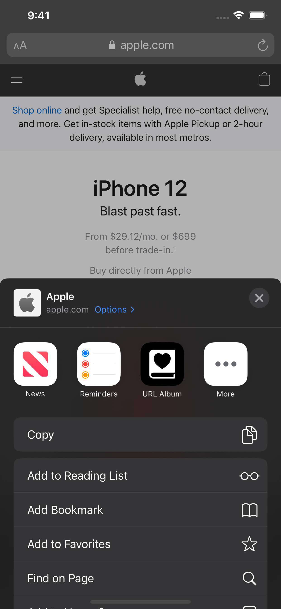
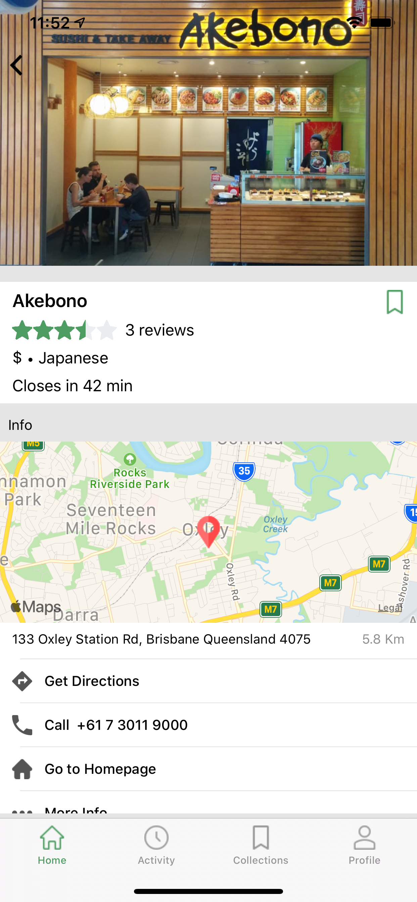
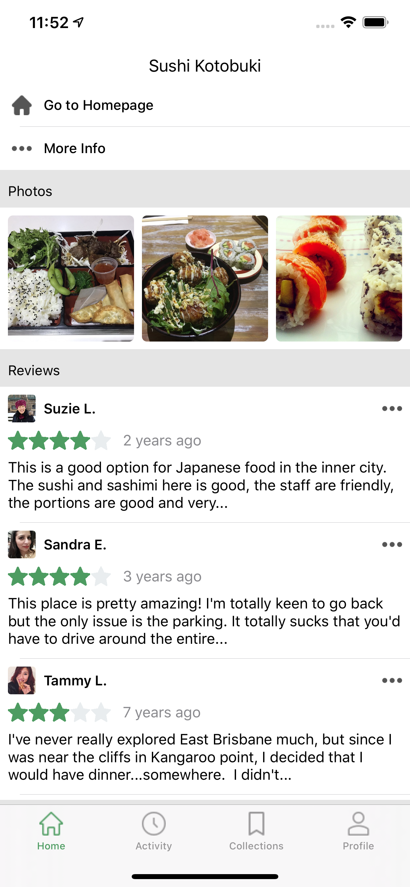

# URL Album

URL Album is designed for users to collect their bookmarks from web and to visualize them through 3 different layout options.

Launched in Jan 2021, the app will grow to have more features such as file operations, search, and integration with 3rd party Open Graph service.

Technologies used: Swift, UIKit, Share extension, Core Data, App Groups, Cloud Kit

&nbsp;&nbsp;&nbsp;&nbsp;&nbsp;&nbsp;&nbsp;&nbsp;&nbsp;&nbsp;

# Foodie
A food app providing restaurant information about price, location, photos, reviews, and more. I have been experimenting with building modern app layouts, Yelp Rest API, and some unit testings in this personal project.

Technologies used: Swift, UIKit, MapKit, Compositional Layout.

&nbsp;&nbsp;&nbsp;&nbsp;&nbsp;&nbsp;&nbsp;&nbsp;&nbsp;&nbsp;

# IELTSQ
[IELTSQ](https://apps.apple.com/au/app/ieltsq/id1222492700) helps IELTS english exam takers effectively prepare for speaking section by providing recent speaking test topics monthly. Users can practice these recent asked speaking topics under the same time frame in the real IELTS exams and record themselves for review.

&nbsp;&nbsp;&nbsp;&nbsp;&nbsp;&nbsp;&nbsp;&nbsp;

# iPECS UCS

iPECS UCS is a collaboration application that provides presence, instant messaging, voice and video calling capabilities. As a part of the team, I delveoped instant messaging, call features and Core Data wrapper.

&nbsp;&nbsp;&nbsp;&nbsp;&nbsp;&nbsp;&nbsp;&nbsp;&nbsp;&nbsp;&nbsp;&nbsp;&nbsp;&nbsp;&nbsp;&nbsp;

