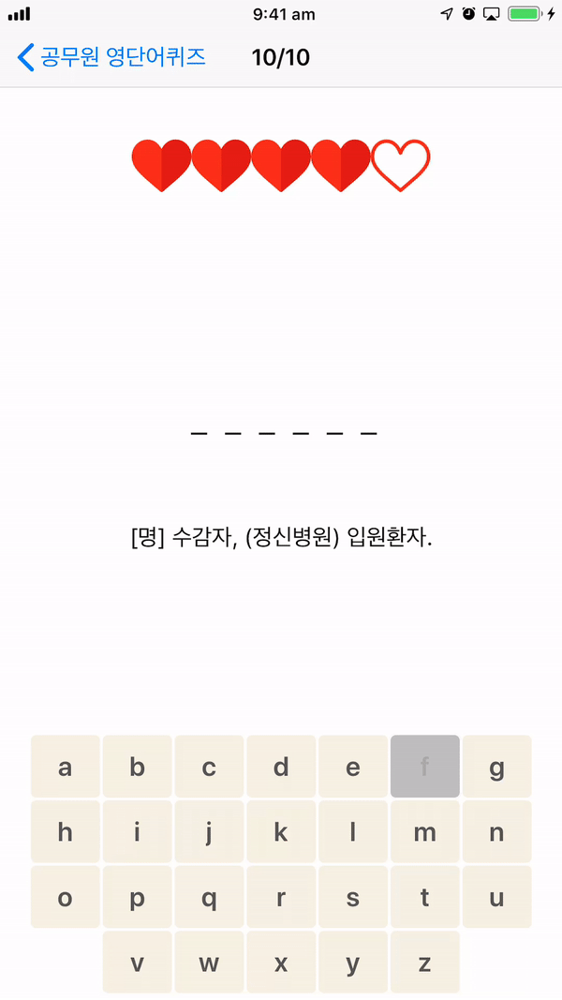

<!-- # Hello!
*Thanks for stopping by*. This repo serves as a kind of ever-changing portfolio of projects I'm currently excited about; please feel free to look around. -->
# English Vocab Quiz
[English Vocab Quiz(공무원 영단어 퀴즈)](https://apps.apple.com/au/app/%EA%B3%B5%EB%AC%B4%EC%9B%90-%EC%98%81%EB%8B%A8%EC%96%B4-%ED%80%B4%EC%A6%88/id1464869171) is built based on the concept of hangman game and targeting Korean users learning English vocabulary. It randomly generates 3 set of game daily and provides review menu for effective learning.

&nbsp;&nbsp;&nbsp;&nbsp;&nbsp;&nbsp;&nbsp;&nbsp;&nbsp;&nbsp;

# IELTSQ
[IELTSQ](https://apps.apple.com/au/app/ieltsq/id1222492700) helps the english test takers to effectively prepare for speaking section by providing recent topics monthly. Users can practice the exam under the same timeset with real test and record their speaking to review their speech.

<!-- &nbsp;&nbsp;&nbsp;&nbsp;&nbsp;&nbsp;&nbsp;&nbsp;&nbsp;&nbsp;&nbsp;&nbsp;&nbsp;&nbsp;&nbsp;&nbsp;&nbsp;&nbsp;&nbsp;&nbsp;   -->

&nbsp;&nbsp;&nbsp;&nbsp;&nbsp;&nbsp;&nbsp;&nbsp;&nbsp;&nbsp;&nbsp;&nbsp;&nbsp;&nbsp;&nbsp;&nbsp;

# iPECS UCS
[iPECS UCS](https://apps.apple.com/au/app/ipecs-ucs/id740488905)—is a collaboration application that provides presence, instant messaging, voice and video calling capabilities.

You can read more about iPECS UCS Client by visiting the [official page](https://cmillerco.com/dalilah) on my website.

<!-- &nbsp;&nbsp;&nbsp;&nbsp;&nbsp;&nbsp;&nbsp;&nbsp;&nbsp;&nbsp;&nbsp;&nbsp;&nbsp;&nbsp;&nbsp;&nbsp;&nbsp;&nbsp;&nbsp;&nbsp; -->

&nbsp;&nbsp;&nbsp;&nbsp;&nbsp;&nbsp;&nbsp;&nbsp;&nbsp;&nbsp;&nbsp;&nbsp;&nbsp;&nbsp;&nbsp;&nbsp;

