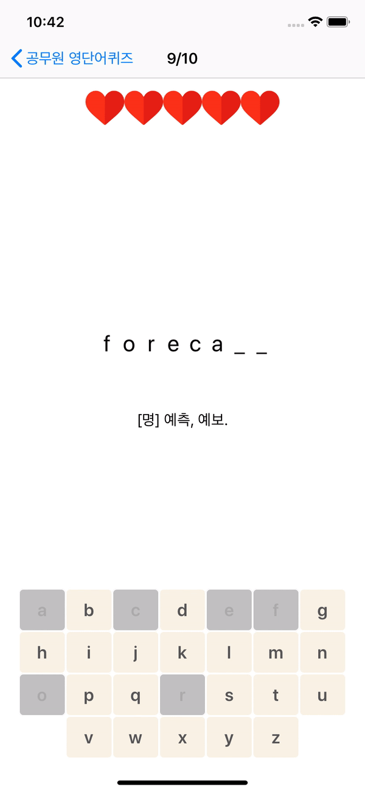
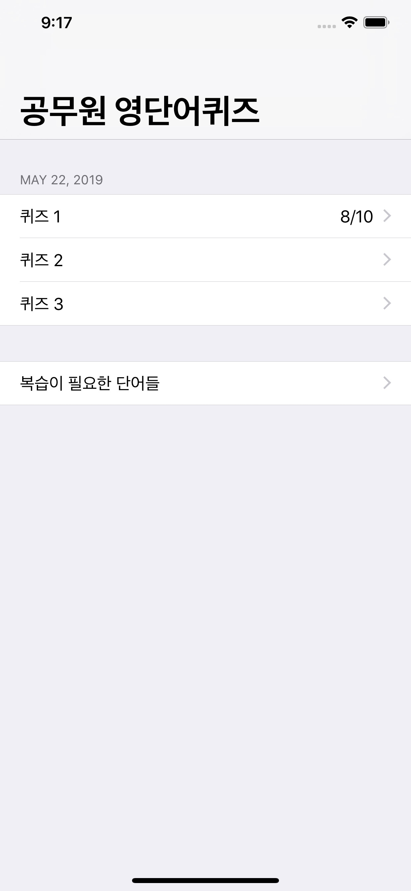
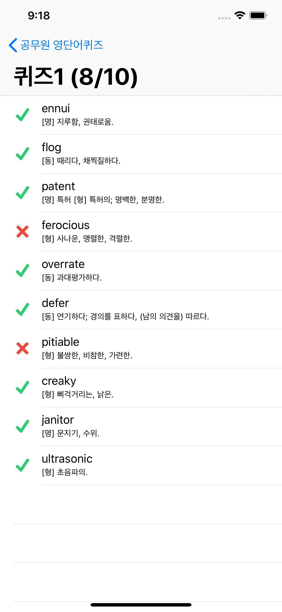
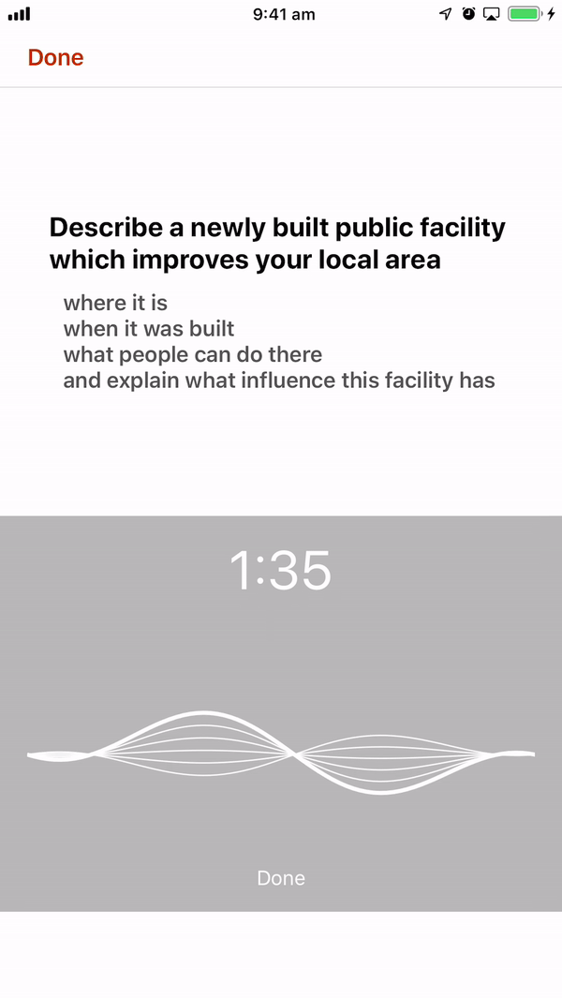
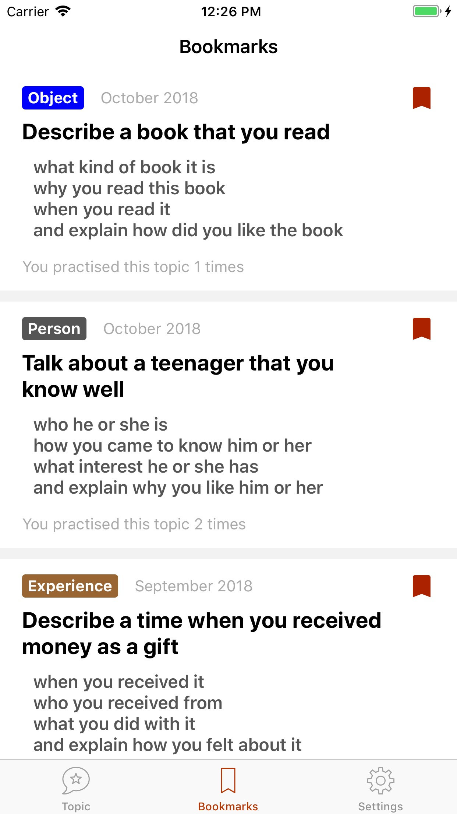
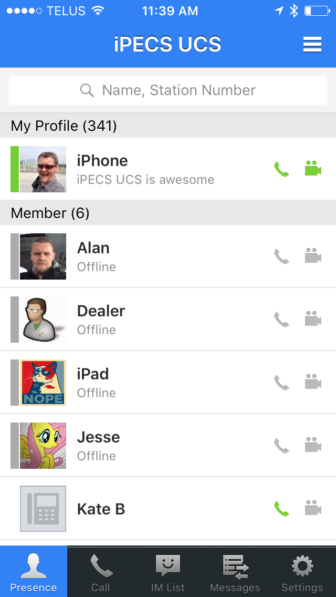
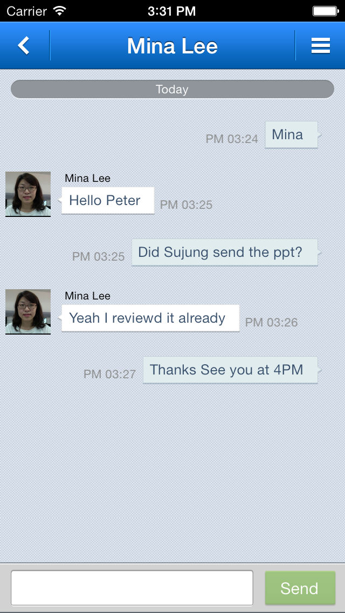

# English Vocab Quiz
[English Vocab Quiz(공무원 영단어 퀴즈)](https://apps.apple.com/au/app/%EA%B3%B5%EB%AC%B4%EC%9B%90-%EC%98%81%EB%8B%A8%EC%96%B4-%ED%80%B4%EC%A6%88/id1464869171) helps Korean users learn advanced English vocabulary. It randomly generates 3 set of game from 2,500 word list daily and provides review menu for effective learning.

### My Role:
Sole developer from an idea to deployment.

&nbsp;&nbsp;&nbsp;&nbsp;&nbsp;&nbsp;&nbsp;&nbsp;&nbsp;&nbsp;

# IELTSQ
[IELTSQ](https://apps.apple.com/au/app/ieltsq/id1222492700) helps IELTS english exam takers effectively prepare for speaking section by providing recent speaking test topics monthly. Users can practice these recent asked speaking topics under the same time frame in the real IELTS exams and record themselves for review.

### My Role:
Sole developer from an idea to deployment.

&nbsp;&nbsp;&nbsp;&nbsp;&nbsp;&nbsp;&nbsp;&nbsp;

# iPECS UCS
[iPECS UCS](https://apps.apple.com/au/app/ipecs-ucs-6/id1239680008)—is a collaboration application that provides presence, instant messaging, voice and video calling capabilities.

### My Role:
Instant messaging, call features and Core Data usage implementation.

&nbsp;&nbsp;&nbsp;&nbsp;&nbsp;&nbsp;&nbsp;&nbsp;&nbsp;&nbsp;&nbsp;&nbsp;&nbsp;&nbsp;&nbsp;&nbsp;

